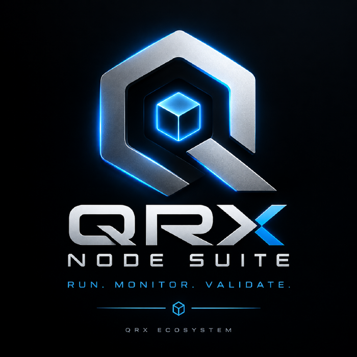

<p align="center">
  
</p>

# QRX Node Suite

**Run. Monitor. Validate.**

Cross platform QRX node and validator management with dashboard, monitoring, alerts and mobile integration.

QRX Node Suite turns a Linux server, Raspberry Pi, Windows PC, Mac, mini PC or VPS into a
manageable piece of QRX infrastructure: node monitoring, validator monitoring, system
monitoring, a web dashboard, local historical metrics, logs, alerts, health checks,
automatic recovery, Telegram notifications, and safe, reversible software updates.

**QRX Node Suite is not QRX Core.** QRX Core is always authoritative. This project never
implements consensus, validator signing, blockchain accounting, wallet cryptography, or
QRX transaction semantics. It is an operations, monitoring and management layer that sits
next to QRX Core and talks to it only through a replaceable adapter boundary. See
[`docs/architecture.md`](docs/architecture.md) for the full boundary rules.

## Install QRX Node Suite

```sh
curl -sSL https://raw.githubusercontent.com/Marcolist/qrx-node-suite/main/install.sh | sudo bash
```

One command, on a fresh Linux server, Raspberry Pi, or VPS: no Go, no Node.js, no
compiling, no manual `systemd` unit editing. It downloads a signed, checksummed
release, installs QRX Node Suite as a systemd service under a dedicated
unprivileged user, installs the pinned QRX Core 0.0.7 node with its statically
linked cryptographic dependency, generates a wallet and safe default configuration, starts
both services, and only prints success once the Agent can reach Core. Supports Ubuntu 22.04/24.04,
Debian 12, and Raspberry Pi OS 64-bit (Pi 4/5), on x86_64 and ARM64. See
[`docs/installer.md`](docs/installer.md) for exactly what it does, every
environment variable, the release signing/trust model, and how to uninstall.
(For a `git clone` + local build development setup instead, see
[Quick start (development)](#quick-start-development) below.)

```
QRX Core -> QRX Adapter -> QRX Agent -> REST API / Event Stream / Dashboard / Guardian /
                                          Telegram / SQLite / (future) telemetry + mobile pairing
```

## Repository layout

| Path | What lives there |
|---|---|
| `agent/` | The QRX Agent — a single Go binary. Adapters, monitoring, guardian, alerts, storage, REST API. |
| `dashboard/` | React + TypeScript + Vite web dashboard, built to static assets the Agent serves. |
| `installer/` | Per-platform install scripts and service definitions (systemd, launchd, Windows). |
| `contracts/` | OpenAPI spec, JSON Schemas, and example payloads shared between Agent and Dashboard. |
| `docs/` | Architecture, security, compatibility, and operational documentation, incl. ADRs. |
| `scripts/` | Developer/build helper scripts. |
| `test/` | Cross-package integration tests. |

## Status

This repository is under active development. The one-line Linux path installs and
monitors the pinned QRX Core 0.0.7 implementation through its verified RPC interface.
Version management and OTA updates use signed manifests, staged activation and rollback;
see [`docs/updates.md`](docs/updates.md). See
[`docs/qrx-0.0.7-interface.md`](docs/qrx-0.0.7-interface.md) for the exact commands and
response fields verified against the running Core.

## Quick start (development)

For contributing to QRX Node Suite itself, not for running it — see
[Install QRX Node Suite](#install-qrx-node-suite) above for that. Requires Go 1.24+, a C
toolchain (for the bundled SQLite driver — no external Go modules are used, see
[`docs/adr/001-agent-language.md`](docs/adr/001-agent-language.md)), and Node.js 20+ with npm
registry access for the dashboard.

```sh
# Agent (mock QRX adapter, no real node required)
cd agent
go build -o bin/agentd ./cmd/agentd
QRX_NODE_SUITE_ADAPTER=mock ./bin/agentd

# Dashboard (separate terminal)
cd dashboard
npm install
npm run dev
```

By default the Agent binds to `127.0.0.1:8787`. Administrative endpoints (updates,
version switching, service restarts) are disabled unless explicitly configured — see
[`docs/security.md`](docs/security.md).

## Documentation

- [`docs/installer.md`](docs/installer.md) — one-line installer: behavior, security, env vars
- [`docs/architecture.md`](docs/architecture.md) — layered architecture and boundary rules
- [`docs/qrx-0.0.7-interface.md`](docs/qrx-0.0.7-interface.md) — QRX 0.0.7 interface notes (verified vs. assumed)
- [`docs/qrx-core-0.0.7-security-report.md`](docs/qrx-core-0.0.7-security-report.md) — Core integration/security repair brief
- [`docs/qrx-compatibility.md`](docs/qrx-compatibility.md) — compatibility matrix and profiles
- [`docs/updates.md`](docs/updates.md) — version management and OTA update architecture
- [`docs/guardian.md`](docs/guardian.md) — health/recovery state machine
- [`docs/alerts.md`](docs/alerts.md) — alert engine
- [`docs/telemetry.md`](docs/telemetry.md) — optional public telemetry (opt-in, off by default)
- [`docs/mobile-pairing.md`](docs/mobile-pairing.md) — future mobile pairing API (read-only by default)
- [`docs/public-map-protocol.md`](docs/public-map-protocol.md) — future public node map protocol
- [`docs/raspberry-pi.md`](docs/raspberry-pi.md) — Raspberry Pi 4/5 support notes
- [`docs/security.md`](docs/security.md) / [`SECURITY.md`](SECURITY.md) — threat model and reporting
- [`docs/development.md`](docs/development.md) — building, testing, project conventions
- [`docs/deployment.md`](docs/deployment.md) — installing on Linux/Raspberry Pi/Windows/macOS

## License

Apache License 2.0 — see [`LICENSE`](LICENSE).
